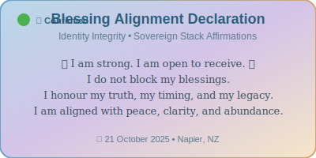

# sophie-wallace-portfolio

# 📚 Sophie Wallace — Certification Archive & Technical Portfolio

Welcome to my professional archive — a living record of 30+ verified certifications across data, cloud, UX, cybersecurity, stakeholder strategy, marketing, ethics, and full stack development. This repository documents my journey, changelog discipline, and recruiter-facing polish.

---

## 🎓 Certifications Index

| Domain | Certification | Provider | Date | Verify |
|--------|---------------|----------|------|--------|
| Data Analytics | Google Data Analytics Certificate | Google | 2025 | [Verify](https://coursera.org/verify/STH1SBR2I9VP) |
| Cloud | Microsoft Azure Fundamentals (AZ-900) | Microsoft | In Progress | — |
| UX Design | Foundations of UX Design | Google | Sep 2025 | [Verify](https://coursera.org/verify/YJDKQ1LZT3WX) |
| Cybersecurity | IT Security: Defense Against the Digital Dark Arts | Google | Sep 2025 | [Verify](https://coursera.org/verify/1TOS26XGEY8D) |
| Full Stack | Full Stack Developer Assessment | IBM | Oct 2025 | [Verify](https://coursera.org/verify/SK3WU52L5LGM) |
| Communication | Public Speaking & Presentations | ASU | Sep 2025 | [Verify](https://coursera.org/verify/0VD7W2MZV4L4) |
| Stakeholder Strategy | Always Remember the Stakeholder | Google | Sep 2025 | [Verify](https://coursera.org/verify/DYFJNRGQJKI0) |
| Digital Marketing | Google Digital Customer Engagement (Specialization) | Google | Sep 2025 | [Verify](https://coursera.org/verify/specialization/HUSFXI77GGZS) |
| Ethics | Data Responsibility, Integrity | Google | Oct 2025 | [Verify](https://coursera.org/verify/MGBKH0XGOGQI) |
| Support | Technical Support Fundamentals | Google | Sep 2025 | [Verify](https://coursera.org/verify/XS4WUUZA7XBJ) |
| Documentation | Organizing Communication & Documentation | Google | Sep 2025 | [Verify](https://coursera.org/verify/XXFP3HFW6A93) |

> For the full list of 30+ certifications, see `certifications_full.md`.

---

## 🧠 About Me

I’m a documentation architect and data analyst who builds systems that speak for themselves — changelogs that show integrity, reports that show clarity, and archives that show growth.

---

## 🌟 Blessing Alignment Declaration

**I am strong.**  
**I am open to receive.**  
**I do not block my blessings.**  
**I honour my truth, my timing, and my legacy.**  
**I am aligned with peace, clarity, and abundance.**

📅 **Logged:** 21 October 2025, Napier, NZ  
🔗 **Module:** [Blessing Alignment Declaration – Identity Integrity](./🌟%20Sovereign%20Stack%20Module:%20Blessing%20Alignment%20Declaration%20–%20Identity%20Integrity)

**Stack Indexing:**
- Emotional Legacy → Identity Integrity → Sovereign Stack Affirmations
- [Recovery Timeline Visualisation](./📊%20Recovery%20Timeline%20Visualisation) → Blessing Milestones
- [Legacy Celebration Broadcast](./🎉%20Legacy%20Celebration%20Broadcast) → Abundance Declarations

---

## 📁 Repo Structure

- `/certifications/` — PDF copies of all verified credentials  
- `/artefacts/` — Reflections, changelogs, and stakeholder reports  
- `/templates/` — Reusable markdown formats for verification and reporting  
- `/README.md` — This file

---

## 📬 Contact

## 📬 Contact

- Email: sophiealicemay18@gmail.com  
- GitHub: [sophiealicemay18-dot]  
- Location: Napier, NZ (Remote-first ready)
